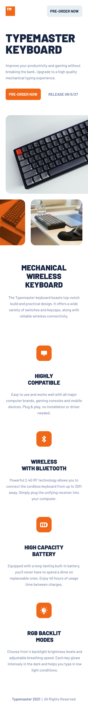
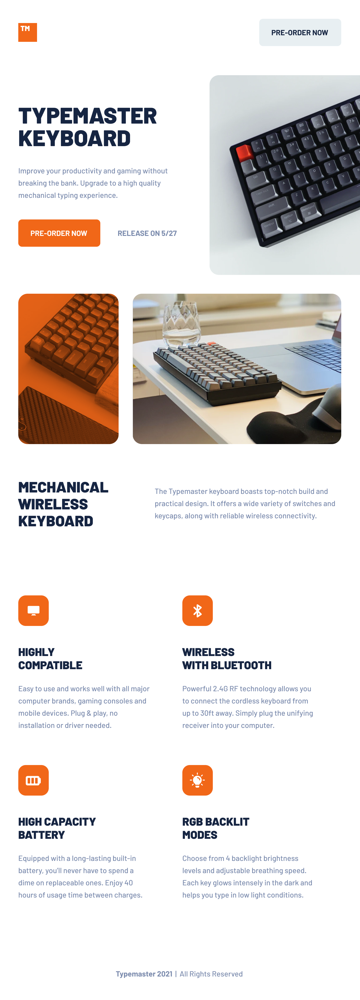
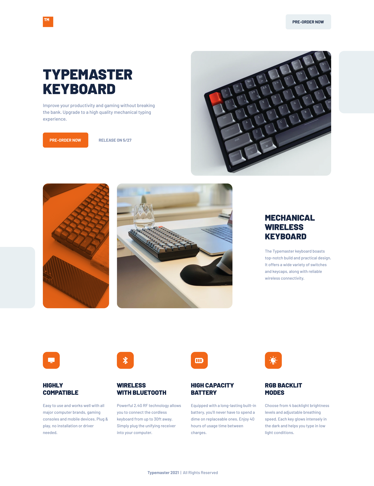

<h1 align="center" style="color: #0366d6;">
   Responsive-Landing-Typemaster 📱 💻 🖥
</h1>

📱 Responsive Features

Typemaster is designed to adapt to a variety of screen sizes, including:

Mobile (≤ 418px): The layout adjusts to provide an optimal experience on mobile devices, ensuring that content remains readable and easy to navigate on smaller screens.

  

   

---

Tablets (≤ 768px): The interface adapts to make better use of the available space on tablets while maintaining the site's usability and aesthetics.

  

   

---

Desktops (≤ 1200px): The design scales to provide a comfortable experience on larger screens, ensuring content is efficiently distributed without compromising aesthetics.

  

   

## Contributions 🤝

Your participation is valuable! If you have ideas, improvements, or find any issues, feel free to:

- Open issues to report bugs or suggest improvements.
- Create pull requests to propose changes directly.
- Share your feedback and experiences to help refine these examples.

Every contribution counts towards building together. 🌟

## Professional Services 💼

I am available to work on web design projects, whether for individuals or businesses. Do you have a project in mind, or need assistance with your website?

Let’s talk and bring your digital vision to life! 🚀
 

## Licencia 📜

This project is licensed under the  [MIT] - Check the [LICENSE](LICENSE) file for more details.

---

<h1 align="center" style="color: #0366d6;">
   Responsive-Landing-Typemaster 📱 💻 🖥
</h1>

📱 Características Responsive

Typemaster está diseñado para adaptarse a una variedad de tamaños de pantalla, incluyendo:

Móviles (≤ 418px): El diseño se ajusta para proporcionar una experiencia óptima en dispositivos móviles, asegurando que el contenido sea legible y fácil de navegar en pantallas pequeñas.

  

   

---

Tablets (≤ 768px): La interfaz se adapta para aprovechar mejor el espacio disponible en tablets, manteniendo la usabilidad y la estética del sitio.

  

   

---

Desktops (≤ 1200px): El diseño se escala para proporcionar una experiencia cómoda en pantallas más grandes, asegurando que el contenido se distribuya de manera eficiente sin sacrificar la estética.

  

   

## Contribuciones 🤝

¡Tu participación es valiosa! Si tienes ideas, mejoras o encuentras algún problema, siéntete libre de:

Abrir issues para reportar errores o sugerir mejoras.
Realizar pull requests para proponer cambios directamente.
Compartir tus comentarios y experiencias para ayudar a perfeccionar estos ejemplos.
Cada aportación cuenta para seguir construyendo juntos. 🌟

## Servicios Profesionales 💼

Estoy disponible para trabajar en proyectos de diseño web, ya sea para particulares o empresas. ¿Tienes un proyecto en mente o necesitas asistencia con tu sitio web?

¡Hablemos y hagamos realidad tu visión digital! 🚀
 

## Licencia 📜

Este proyecto está bajo la licencia [MIT] - Consulta el archivo [LICENSE](LICENSE) para más detalles.
